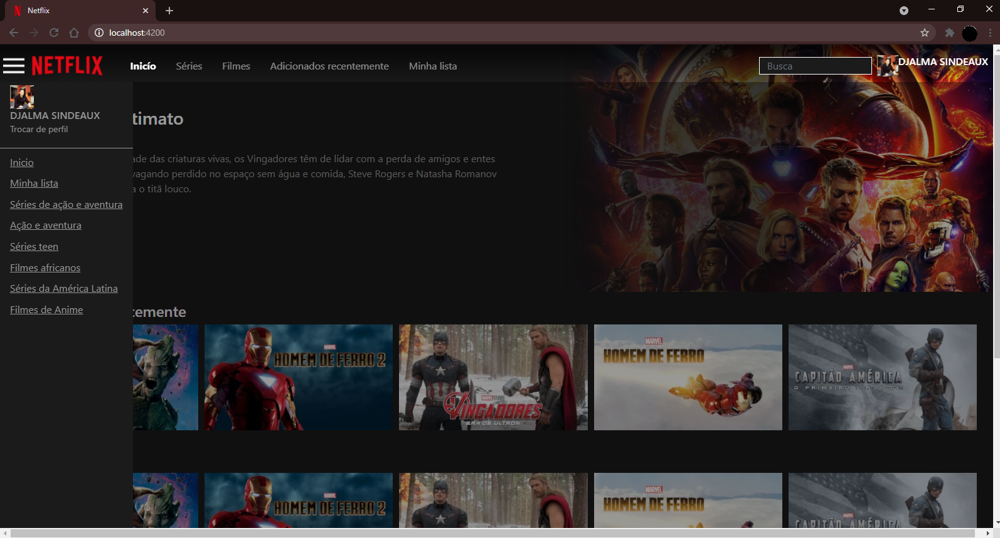

# NetflixClone :clapper:

Esse projeto está sendo desenvolvido com o Angular.

# Aprendendo :computer:

Essa a melhor forma de aprender uma nova ferramenta, praticando, praticando e praticando muito!

#### Abaixo está alguns fotos do projeto.

### Essa é a parte frontal:

### Essa é com o Nav-bar ativado:

#### Notem que a tela escurece graças ao ´backdrop´. Ele é ativado dinâmicamente pelo angular, assim que clicamos no nav-bar.
